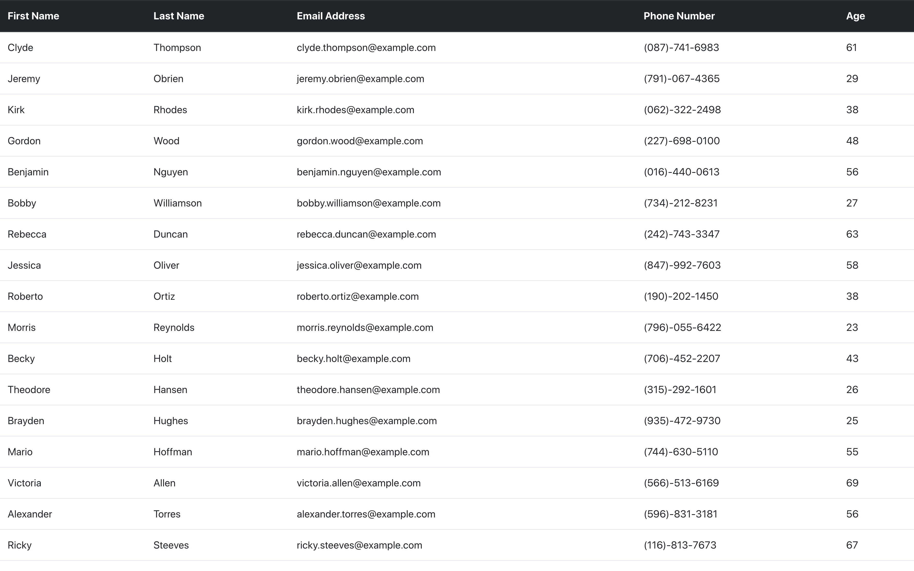

# React-Employee-Directory

# Table of Contents

* [Description](#Description)
* [Technologies](#Technologies)
* [Author-Info](#Author-Info)

# Description:
This app creates a table of employees from randomuser.me in any length desired. The table has colums of employee's first name, last name, email address, phone number, and age.

# Technologies:
* React
* Node
* Express
* randomuser.me
* Service-worker
* Manifest

# Author-Info:

* Doug Livingston

* Github--dlivingston866

* Github Pages 

